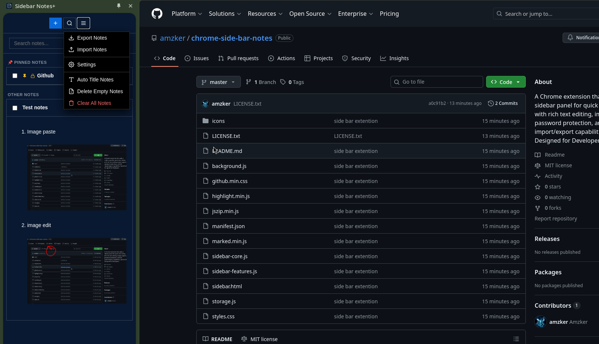
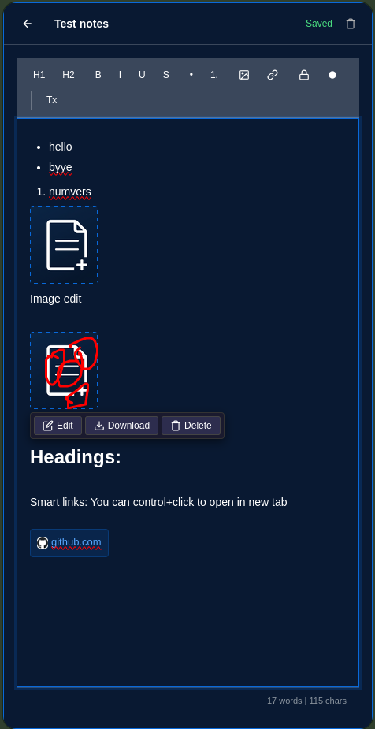

# Sidebar Notes+

A Chrome extension that adds a sidebar panel for quick note-taking with rich text editing, image support, password protection, and full import/export capabilities.

## Features

- **Sidebar interface** - Opens as a side panel in Chrome, stays accessible while browsing
- **WYSIWYG editor** - Rich text editing with toolbar for headings, bold, italic, underline, strikethrough, lists, and links
- **Image support** - Paste images from clipboard or upload from files directly into notes
- **Image editor** - Crop and draw on images inline
- **Password protection** - Lock individual notes with a password; locked notes cannot be viewed, copied, or deleted without the password
- **Pin notes** - Pin important notes to the top in a dedicated section
- **Color tagging** - Assign border colors to notes for visual organization
- **Smart links** - URLs are rendered as favicon-labeled link chips; Ctrl+Click opens in new tab
- **Search** - Search across note titles and content with highlighted results
- **Auto-save** - Notes save automatically as you type
- **Auto-title** - Bulk rename untitled notes using their first line of content
- **Delete empty notes** - Clean up notes with no content in one click
- **Bulk selection** - Select multiple notes with checkboxes and delete in batch
- **Word count** - Live word and character count in the editor footer
- **Markdown shortcuts** - Type `#`, `##`, `-`, `*`, or `1.` followed by space for instant formatting
- **Keyboard shortcuts** - Ctrl+B, Ctrl+I, Ctrl+U for formatting; Ctrl+S to save; Escape to close editor
- **Customizable theme** - Choose from preset dark themes or pick any color
- **Export/Import** - Export all notes as a single `.anotes` file (ZIP with images); import from `.anotes` or `.json`
- **Local storage** - All data stays on your device; nothing is sent to any server

## Installation

1. Download the latest release ZIP from the [Releases](../../releases) page, or clone this repository
2. If you downloaded the ZIP, extract it to a folder
3. Open Chrome and go to `chrome://extensions/`
4. Enable **Developer mode** (toggle in the top right corner)
5. Click **Load unpacked**
6. Select the extracted folder (the one containing `manifest.json`)
7. The extension icon will appear in your toolbar — click it to open the sidebar

To move the sidebar to the left side, right-click inside the sidebar and select "Move side panel to left", or go to Chrome Settings > Appearance > Side panel > Left.

## Permissions

| Permission      | Reason                                        |
|-----------------|-----------------------------------------------|
| storage         | Save notes locally in Chrome                  |
| sidePanel       | Open the extension as a sidebar panel         |
| clipboardRead   | Paste images from clipboard into notes        |
| clipboardWrite  | Copy note content to clipboard                |
| activeTab       | Required for side panel functionality         |
| scripting       | Required for side panel functionality         |
| tabs            | Required for side panel functionality         |
| downloads       | Download exported `.anotes` files             |

## Privacy

All data is stored locally on your device using Chrome's storage API. No data is transmitted to any external server. Exported files are saved directly to your downloads folder.

## Compatibility

- Google Chrome 116 or later (side panel API required)
- Chromium-based browsers with side panel support (Edge, Brave, etc.)

## License

MIT License — free to use, modify, and distribute.